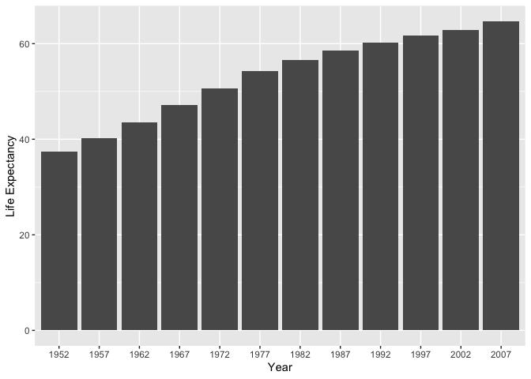

hw\_02
================

``` r
library(gapminder)
library(tidyverse)
```

Exercise 1: Basic
dplyr

``` r
# 1.1 Using filter() to subset gapminder data to three countries of choice in the 1970’s.
gapminder %>%
filter (year > 1970 & year < 1980 | year == 1970,  
           country == "China" | country == "India" | country == "Pakistan")
```

    ## # A tibble: 6 x 6
    ##   country  continent  year lifeExp       pop gdpPercap
    ##   <fct>    <fct>     <int>   <dbl>     <int>     <dbl>
    ## 1 China    Asia       1972    63.1 862030000      677.
    ## 2 China    Asia       1977    64.0 943455000      741.
    ## 3 India    Asia       1972    50.7 567000000      724.
    ## 4 India    Asia       1977    54.2 634000000      813.
    ## 5 Pakistan Asia       1972    51.9  69325921     1050.
    ## 6 Pakistan Asia       1977    54.0  78152686     1176.

``` r
# 1.2 Using the pipe operator %>% to select “country” and “gdpPercap” from filtered dataset in 1.1. 
gapminder %>%
filter (year > 1970 & year < 1980 | year == 1970,  
           country == "China" | country == "India" | country == "Pakistan") %>%
 select(country, gdpPercap)
```

    ## # A tibble: 6 x 2
    ##   country  gdpPercap
    ##   <fct>        <dbl>
    ## 1 China         677.
    ## 2 China         741.
    ## 3 India         724.
    ## 4 India         813.
    ## 5 Pakistan     1050.
    ## 6 Pakistan     1176.

``` r
# 1.3 Filtering gapminder to all entries that have experienced a drop in life expectancy.
gapminder %>%
 group_by(country) %>% 
 mutate(lifeExp_decrease = lifeExp - lag(lifeExp, 1, order_by = year)) %>%
 drop_na() %>%
 filter(lifeExp_decrease < 0)
```

    ## # A tibble: 102 x 7
    ## # Groups:   country [142]
    ##    country  continent  year lifeExp     pop gdpPercap lifeExp_decrease
    ##    <fct>    <fct>     <int>   <dbl>   <int>     <dbl>            <dbl>
    ##  1 Albania  Europe     1992    71.6 3326498     2497.           -0.419
    ##  2 Angola   Africa     1987    39.9 7874230     2430.           -0.036
    ##  3 Benin    Africa     2002    54.4 7026113     1373.           -0.371
    ##  4 Botswana Africa     1992    62.7 1342614     7954.           -0.877
    ##  5 Botswana Africa     1997    52.6 1536536     8647.          -10.2  
    ##  6 Botswana Africa     2002    46.6 1630347    11004.           -5.92 
    ##  7 Bulgaria Europe     1977    70.8 8797022     7612.           -0.09 
    ##  8 Bulgaria Europe     1992    71.2 8658506     6303.           -0.15 
    ##  9 Bulgaria Europe     1997    70.3 8066057     5970.           -0.87 
    ## 10 Burundi  Africa     1992    44.7 5809236      632.           -3.48 
    ## # … with 92 more rows

``` r
# 1.4 Filtering gapminder so that it shows the max GDP per capita experienced by each country.

gapminder %>%
  group_by(country, continent) %>%
  summarise(maxGDPperCap = max(gdpPercap))
```

    ## # A tibble: 142 x 3
    ## # Groups:   country [142]
    ##    country     continent maxGDPperCap
    ##    <fct>       <fct>            <dbl>
    ##  1 Afghanistan Asia              978.
    ##  2 Albania     Europe           5937.
    ##  3 Algeria     Africa           6223.
    ##  4 Angola      Africa           5523.
    ##  5 Argentina   Americas        12779.
    ##  6 Australia   Oceania         34435.
    ##  7 Austria     Europe          36126.
    ##  8 Bahrain     Asia            29796.
    ##  9 Bangladesh  Asia             1391.
    ## 10 Belgium     Europe          33693.
    ## # … with 132 more rows

``` r
# 1.5 Producing a scatterplot of Canada’s life expectancy vs. GDP per capita using ggplot2, without defining a new variable.

gapminder %>% 
  filter(country == "Canada") %>% 
  ggplot(aes(gdpPercap, lifeExp)) + 
  geom_point() +
  scale_x_log10("GDP per capita", labels = scales::dollar_format()) + 
  labs(title="Canada", y="Life Expectancy")
```

<!-- -->

Exercise 2: Explore individual variables with dplyr

I will be exploring two variables - life expectancy and continents

To understand the possible values in the variable “continents” I will
explore the number of observation per continent and how many unique
countries are there in each continent.

``` r
gapminder %>%
  group_by(continent) %>%
  summarise(number_of_observations = n(),
            number_of_countries = n_distinct(country))
```

    ## # A tibble: 5 x 3
    ##   continent number_of_observations number_of_countries
    ##   <fct>                      <int>               <int>
    ## 1 Africa                       624                  52
    ## 2 Americas                     300                  25
    ## 3 Asia                         396                  33
    ## 4 Europe                       360                  30
    ## 5 Oceania                       24                   2

Asia and Africa have the largest number of countries.

Now I will explore the variable life expectancy. I will first explore
the range of the variable by continent in year 2007

``` r
gapminder %>%
  filter(year == "2007") %>%
  group_by(continent) %>%
  summarise(min_lifeExp = min(lifeExp), max_lifeExp = max(lifeExp)) %>%
  mutate(range = max_lifeExp - min_lifeExp)
```

    ## # A tibble: 5 x 4
    ##   continent min_lifeExp max_lifeExp range
    ##   <fct>           <dbl>       <dbl> <dbl>
    ## 1 Africa           39.6        76.4 36.8 
    ## 2 Americas         60.9        80.7 19.7 
    ## 3 Asia             43.8        82.6 38.8 
    ## 4 Europe           71.8        81.8  9.98
    ## 5 Oceania          80.2        81.2  1.03

The range is largest for Asia and Africa. One of the reasons for this
can be large number of countries as we saw in the previous table.
However, Europe has only 3 countries less than Asia but its range of
life expectancy is much smaller than Asia.

Now I will explore the summaries of lifeExp by continent in the year
1952 and 2007 to find typical values through median and mean and spread
via standard deviation

``` r
gapminder %>%
  filter(year %in% c(1952,2007)) %>%
  group_by(continent, year) %>%
  summarize(median_lifeExp = median(lifeExp),
            mean_lifeExp = mean(lifeExp, na.rm = TRUE),
            standard_deviation_lifeExp = sd(lifeExp, na.rm = TRUE))
```

    ## # A tibble: 10 x 5
    ## # Groups:   continent [5]
    ##    continent  year median_lifeExp mean_lifeExp standard_deviation_lifeExp
    ##    <fct>     <int>          <dbl>        <dbl>                      <dbl>
    ##  1 Africa     1952           38.8         39.1                      5.15 
    ##  2 Africa     2007           52.9         54.8                      9.63 
    ##  3 Americas   1952           54.7         53.3                      9.33 
    ##  4 Americas   2007           72.9         73.6                      4.44 
    ##  5 Asia       1952           44.9         46.3                      9.29 
    ##  6 Asia       2007           72.4         70.7                      7.96 
    ##  7 Europe     1952           65.9         64.4                      6.36 
    ##  8 Europe     2007           78.6         77.6                      2.98 
    ##  9 Oceania    1952           69.3         69.3                      0.191
    ## 10 Oceania    2007           80.7         80.7                      0.729

Now I will use boxplot for a visual exploration of the typical values
and the spread over the years

``` r
gapminder %>% 
  select(lifeExp, year) %>%
  mutate(year= factor(year)) %>% 
  ggplot(aes(year, lifeExp)) +
  scale_y_log10("Life Expectancy") +
  geom_boxplot() + xlab("Year")
```

<!-- -->

Now I will explore the distribution of life expectancy in one country
ie. India over the years using bar graphs.

``` r
gapminder%>%
  filter(country == "India")%>%
  select(lifeExp, year) %>%
  mutate(year = factor(year)) %>%
  ggplot(aes(year, lifeExp)) +
  scale_y_continuous ("Life Expectancy") +
  geom_bar(stat = "identity") + xlab("Year")
```

<!-- -->

Exercise 3: Explore various plot types.

``` r
Orange %>% 
  group_by(Tree) %>% 
  select(age, circumference) %>% 
  ggplot(aes(age, circumference, color=Tree)) +
  geom_line() +
  xlab("age") + 
  labs(title="Age by Circumference of Orange Trees", y="Circumference") +
  theme(plot.title = element_text(hjust = 0.5))
```

    ## Adding missing grouping variables: `Tree`

<!-- --> This graph
shows how the circumference of trees increase as their age increases.

``` r
Orange %>% 
  filter(Tree == "2") %>% 
  select(age, circumference) %>% 
  ggplot(aes(circumference, age)) +
  geom_bar(stat = "identity") + 
  labs(title="Circumference by Age of Orange Tree 2") +
  theme(plot.title = element_text(hjust = 0.5))
```

<!-- -->

Bonus Exercise

``` r
filter(gapminder, country == c("Rwanda", "Afghanistan"))
```

    ## # A tibble: 12 x 6
    ##    country     continent  year lifeExp      pop gdpPercap
    ##    <fct>       <fct>     <int>   <dbl>    <int>     <dbl>
    ##  1 Afghanistan Asia       1957    30.3  9240934      821.
    ##  2 Afghanistan Asia       1967    34.0 11537966      836.
    ##  3 Afghanistan Asia       1977    38.4 14880372      786.
    ##  4 Afghanistan Asia       1987    40.8 13867957      852.
    ##  5 Afghanistan Asia       1997    41.8 22227415      635.
    ##  6 Afghanistan Asia       2007    43.8 31889923      975.
    ##  7 Rwanda      Africa     1952    40    2534927      493.
    ##  8 Rwanda      Africa     1962    43    3051242      597.
    ##  9 Rwanda      Africa     1972    44.6  3992121      591.
    ## 10 Rwanda      Africa     1982    46.2  5507565      882.
    ## 11 Rwanda      Africa     1992    23.6  7290203      737.
    ## 12 Rwanda      Africa     2002    43.4  7852401      786.

“==” is a logical operator that has here converted country into a vector
of length 2 consisting of Rwanda and Afghanistan. “==” is meant to
compare if two things are exactly equal. Since, here the vectors are not
of equal length, so Vectors- Rwanda and Afghanistan are recycled.

To fix this we can use %in% which checks whether or not the object (here
country) is contained in the other object(c(Rwanda, Afghanistan) or not
and then filter drops the NA values.So we get the following table.

``` r
gapminder %>%
    filter (country %in% c("Rwanda", "Afghanistan"))
```

    ## # A tibble: 24 x 6
    ##    country     continent  year lifeExp      pop gdpPercap
    ##    <fct>       <fct>     <int>   <dbl>    <int>     <dbl>
    ##  1 Afghanistan Asia       1952    28.8  8425333      779.
    ##  2 Afghanistan Asia       1957    30.3  9240934      821.
    ##  3 Afghanistan Asia       1962    32.0 10267083      853.
    ##  4 Afghanistan Asia       1967    34.0 11537966      836.
    ##  5 Afghanistan Asia       1972    36.1 13079460      740.
    ##  6 Afghanistan Asia       1977    38.4 14880372      786.
    ##  7 Afghanistan Asia       1982    39.9 12881816      978.
    ##  8 Afghanistan Asia       1987    40.8 13867957      852.
    ##  9 Afghanistan Asia       1992    41.7 16317921      649.
    ## 10 Afghanistan Asia       1997    41.8 22227415      635.
    ## # … with 14 more rows
