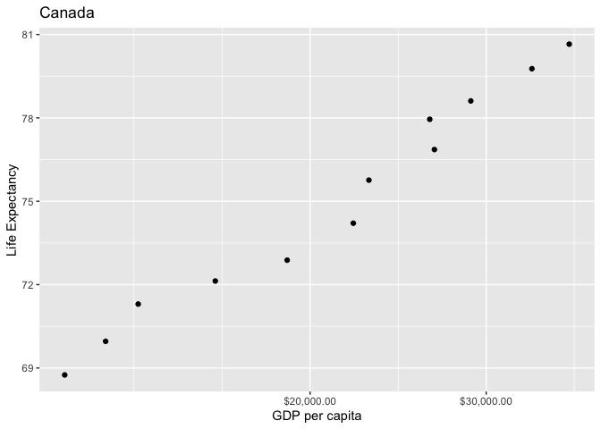

```r
library(gapminder)
library(tidyverse)
```


```r
# 1.1 Using filter() to subset gapminder data to three countries of choice in the 1970’s.
gapminder %>%
filter (year > 1970 & year < 1980 | year == 1970,  
           country == "China" | country == "India" | country == "Pakistan")
```

```
## # A tibble: 6 x 6
##   country  continent  year lifeExp       pop gdpPercap
##   <fct>    <fct>     <int>   <dbl>     <int>     <dbl>
## 1 China    Asia       1972    63.1 862030000      677.
## 2 China    Asia       1977    64.0 943455000      741.
## 3 India    Asia       1972    50.7 567000000      724.
## 4 India    Asia       1977    54.2 634000000      813.
## 5 Pakistan Asia       1972    51.9  69325921     1050.
## 6 Pakistan Asia       1977    54.0  78152686     1176.
```


```r
# 1.2 Using the pipe operator %>% to select “country” and “gdpPercap” from filtered dataset in 1.1. 
gapminder %>%
filter (year > 1970 & year < 1980 | year == 1970,  
           country == "China" | country == "India" | country == "Pakistan") %>%
 select(country, gdpPercap)
```

```
## # A tibble: 6 x 2
##   country  gdpPercap
##   <fct>        <dbl>
## 1 China         677.
## 2 China         741.
## 3 India         724.
## 4 India         813.
## 5 Pakistan     1050.
## 6 Pakistan     1176.
```


```r
# 1.3 Filtering gapminder to all entries that have experienced a drop in life expectancy.
gapminder %>%
 group_by(country) %>% 
 mutate(lifeExp_decrease = lifeExp - lag(lifeExp, 1, order_by = year)) %>%
 drop_na() %>%
 filter(lifeExp_decrease < 0)
```

```
## # A tibble: 102 x 7
## # Groups:   country [142]
##    country  continent  year lifeExp     pop gdpPercap lifeExp_decrease
##    <fct>    <fct>     <int>   <dbl>   <int>     <dbl>            <dbl>
##  1 Albania  Europe     1992    71.6 3326498     2497.           -0.419
##  2 Angola   Africa     1987    39.9 7874230     2430.           -0.036
##  3 Benin    Africa     2002    54.4 7026113     1373.           -0.371
##  4 Botswana Africa     1992    62.7 1342614     7954.           -0.877
##  5 Botswana Africa     1997    52.6 1536536     8647.          -10.2  
##  6 Botswana Africa     2002    46.6 1630347    11004.           -5.92 
##  7 Bulgaria Europe     1977    70.8 8797022     7612.           -0.09 
##  8 Bulgaria Europe     1992    71.2 8658506     6303.           -0.15 
##  9 Bulgaria Europe     1997    70.3 8066057     5970.           -0.87 
## 10 Burundi  Africa     1992    44.7 5809236      632.           -3.48 
## # … with 92 more rows
```


```r
# 1.4 Filtering gapminder so that it shows the max GDP per capita experienced by each country.

gapminder %>%
  group_by(country, continent) %>%
  summarise(maxGDPperCap = max(gdpPercap))
```

```
## # A tibble: 142 x 3
## # Groups:   country [142]
##    country     continent maxGDPperCap
##    <fct>       <fct>            <dbl>
##  1 Afghanistan Asia              978.
##  2 Albania     Europe           5937.
##  3 Algeria     Africa           6223.
##  4 Angola      Africa           5523.
##  5 Argentina   Americas        12779.
##  6 Australia   Oceania         34435.
##  7 Austria     Europe          36126.
##  8 Bahrain     Asia            29796.
##  9 Bangladesh  Asia             1391.
## 10 Belgium     Europe          33693.
## # … with 132 more rows
```


```r
# 1.5 Producing a scatterplot of Canada’s life expectancy vs. GDP per capita using ggplot2, without defining a new variable.

gapminder %>% 
  filter(country == "Canada") %>% 
  ggplot(aes(gdpPercap, lifeExp)) + 
  geom_point() +
  scale_x_log10("GDP per capita", labels = scales::dollar_format()) + 
  labs(title="Canada", y="Life Expectancy")
```

<!-- -->

