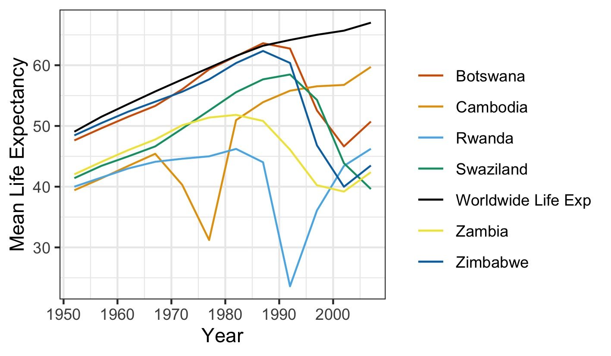

```{r setup, include=FALSE}
knitr::opts_chunk$set(echo = TRUE)
```

```{r}
library(gapminder)
library(tidyverse)
library(dplyr)
library(forcats)
library(ggplot2)
library(gridExtra)
```

## Exercise 1: Explain the value of the here::here package

After reading the articles by Malcolmm Barret and Jenny Bryan, I believe the main value of using here::here package is in creating code that runs reliably across different computers, different users and over a period of time, if used with Rstudio projects. If we use setwd() command, it basically defines the path that only the creator of the file has. If the file lands in a different place on a different computer, the whole path will need to be manually changed not to mention the backslash/frontslash difference between MAC and PC. Using rm(list = ls()) command just deletes created objects from the global workspace but doesn't create a fresh R process. This means that the file may have hidden non-default values and loaded packages which are not shown explicitly. 

If we use here along with rstudio project it solves both the problems as here package builds a directory just relative to the project's top level directory. This means that file is easier to locate and paths don't need to be defined manually. By opening a .Rproj file we are able to get a fresh instance of RStudio, along with the needed directory. This means no hidden default values or loaded packages. 

## Exercise 2: Factor management : with gapminder data set

```{r}
class(gapminder$continent)
levels(gapminder$continent)
nlevels(gapminder$continent)

```
```{r}
gapminder %>%
  nrow()
```


```{r}
gapminder %>%
  ggplot() +
  geom_bar(aes(fct_infreq(continent))) +
  coord_flip()+
  theme_bw() +
  ylab("Number of entries") + xlab("Continent")
```
Currently the gapminder data set has 1,704 rows with each continent having the diplayed amount of entries. 


Drop Oceania.  
```{r}
dropOCN_gap <- gapminder %>%
  filter(continent %in% c("Asia", "Americas", "Africa", "Europe"))
```

```{r}
dropOCN_gap %>%
  nrow()
```

```{r}
dropOCN_gap %>%
  ggplot() +
  geom_bar(aes(fct_infreq(continent))) +
  coord_flip()+
  theme_bw() +
  ylab("Number of entries") + xlab("Continent")
```
After dropping Oceania, the new dataset has 1,680 rows. And the plot here no more shows the Continent Oceania that confirms that it has been dropped. 


Dropping unused fcator Oceania
```{r}
dropOCN_gap_dropped <- dropOCN_gap %>% 
  droplevels()

dropOCN_gap_dropped$continent %>%
  nlevels()

dropOCN_gap_dropped$continent %>%
  levels()

```
The new data set now has 4 levels instead of 5.


Reorder the levels of country or continent.

```{r}
gapminder %>%
  filter(continent == "Asia") %>%
  group_by(country)%>%
  summarize(sd = sd(gdpPercap))
```
```{r}
gapminder %>%
  filter(continent == "Asia") %>%
  group_by(country)%>%
  summarize(sd = sd(gdpPercap)) %>%
  ggplot(aes(country, sd)) +
  geom_point() +
  scale_y_log10() +
  theme(axis.text.x = element_text(angle = 90))
```
```{r}
gapminder %>%
  filter(continent == "Asia") %>%
  group_by(country)%>%
  summarize(sd = sd(gdpPercap)) %>%
  ggplot(aes(country, sd)) +
  geom_point(aes(x=fct_reorder(country, sd))) +
  scale_y_log10() +
  theme(axis.text.x = element_text(angle = 90))
```


## Exercise 3: File I/O

You are expected to create something new, probably by filtering or grouped-summarization of your dataset (for e.g., Singer, Gapminder, or another dataset), export it to disk and then reload it back in using one of the packages above. You should use here::here() for reading in and writing out.

```{r}
(gapminder_sum = gapminder %>% 
  group_by(continent) %>% 
  summarise(mean_gdp = mean(gdpPercap), sd_gdp = sd(gdpPercap), max_gdp = max(gdpPercap), min_gdp = min(gdpPercap)))
```
```{r}
class(gapminder_sum$continent)
```

Continent is a factor in the gapminder_sum created dataset. 

Writing the dataset with here::here
```{r}
gapminder_sum %>% 
  write_csv(here::here("gapminder_sum.csv"))
```


Importing the saved data set back in. 
```{r}
gapminder_sum = read_csv(here::here("gapminder_sum.csv"))

class(gapminder_sum$continent)
```

Here, we can see that after importing the saved dataset, continent has become a character from a factor. 

We can use the col_types argument to solve this problem. 
```{r}
gapminder_sum = read_csv(here::here("gapminder_sum.csv"),  col_types = cols(continent=col_factor()))

class(gapminder_sum$continent)
nlevels(gapminder_sum$continent)
levels(gapminder_sum$continent)
```

The continent is now a factor ordered alphabetically which is a default way of ordering factors in R. 

```{r}
gapminder_sum %>% 
  ggplot(aes(continent, sd_gdp))+ 
  geom_bar(stat = "identity") + 
  coord_flip() 
```

Reordering continents according to standard deviation. 

```{r}
gapminder_sum %>% 
  ggplot(aes(continent, sd_gdp))+ 
  geom_bar(aes(fct_reorder(continent, sd_gdp)),stat = "identity") + 
  coord_flip() 
```

## Exercise 4:Visualization design

Go back through your previous assignments and class participation activities and find figures you created prior to the last week of the course. Recreate at least one figure in light of something you learned in the recent class meetings about visualization design and color.

Reproducing graph from hw03 from Task 6: Finding countries with interesting stories 

I wanted to find countries that have experience a dramatic drop in their lifeExpectancy since their first recorded life Expectancy in 1952. Such a drop would reveal countries that have not been doing so well and might help us investigate the reasons as well. 
```{r}
gapminder %>%
  select(country, continent, year, lifeExp, gdpPercap) %>%
  group_by(country)%>%
  filter(lifeExp == first(lifeExp) | lifeExp == min(lifeExp)) %>%
  mutate(freq = n()) %>%
  ungroup() %>%
  filter(freq > 2 | freq == 2)
```
From this table we find that Botswana in 2002, Cambodia in 1977, Rwanda in 1992, Swaziland in 2007, Zambia in 2002 and Zimbabwe in 2002 have experienced such an extreme low in thier lifeExpectancy. Five of the six such countries lie in Africa.


```{r}
(gapminder_meanlifeExp <- gapminder %>%
                         group_by(year) %>%
                         summarise(mean_lifeExp = mean(lifeExp),
                                   median_lifeExp = median(lifeExp)))
```

```{r}
(Original <- gapminder %>%
  filter(country %in% c("Botswana", "Cambodia", "Rwanda", "Swaziland", "Zambia", "Zimbabwe")) %>%
  group_by(country, year) %>%
  summarise(mean_lifeExp = mean(lifeExp)) %>%
  ggplot() +
  geom_line(aes(year, mean_lifeExp, group = country, colour = country)) +
  geom_line(data = gapminder_meanlifeExp, aes(x = year, y = mean_lifeExp)) +
  theme_bw())
```

In this graph that I produced in hw03 I wanted to compare the average lifeexpectancy of countries that have experienced a drop in lifeExpectancy since 1952 over the years with the average rate of change in lifeexpectancy worldwide. But this graph doesn't explain a few things and violates some of the basic principle of effective plotting  -

1)I didn't explain the black line in the plot and didn't create a legend for it.
2)I didn't update the labels on x and y axis. Label mean_lifeExp is a little awkward. 
3)I didn't have colour schemes that are colour-blind friendly and perceptually uniform 

```{r}
Updated <- gapminder %>%
  filter(country %in% c("Botswana", "Cambodia", "Rwanda", "Swaziland", "Zambia", "Zimbabwe")) %>%
  group_by(country, year) %>%
  summarise(mean_lifeExp = mean(lifeExp)) %>%
  ggplot() +
  geom_line(aes(year, mean_lifeExp, group = country, colour = country)) +
  geom_line(data = gapminder_meanlifeExp, aes(x = year, y = mean_lifeExp, colour = "Worldwide Life Exp" )) +
  xlab("Year") + ylab("Mean Life Expectancy") +
  scale_colour_manual(name = '', values =c("Botswana" = "#D55E00", "Cambodia" = "#E69F00" , "Rwanda" = "#56B4E9" , "Swaziland"   ="#009E73", "Zambia" = "#F0E442", "Zimbabwe" = "#0072B2", 'Worldwide Life Exp'='black')) +
  theme_bw()

grid.arrange(Original, Updated)
```


So in the updated graph I explained the black line, used colour blind friendly palete and updated the legends. However, I struggled with making separate legends for the two layers and 

## Exercise 5: Writing figures to file

Saving the Updated plot using ggsave

```{r}
ggsave("Updated.jpg", height=7, width=12, units="cm")
```





